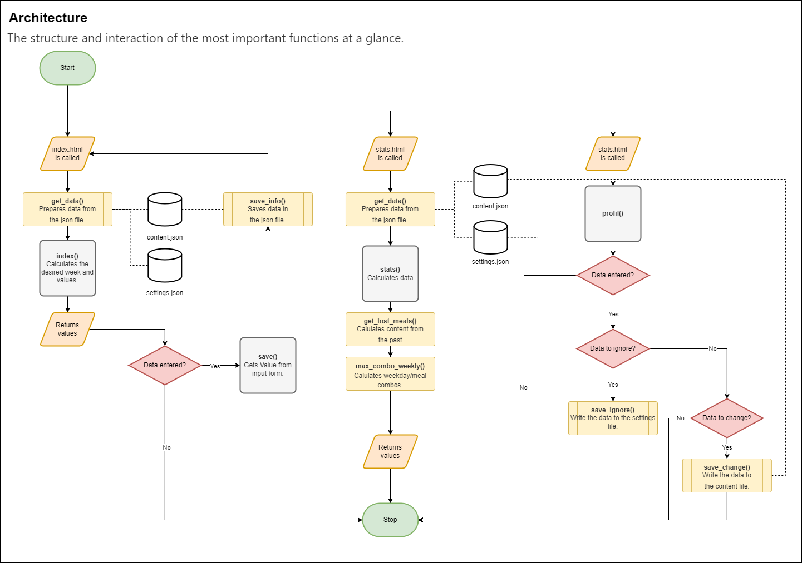

# Mealy

Mealy serves as a tool to organize your weekly meals, to inspire your planning, to plan "like" you would 
and to deliver in-depth information about your daily dinners.

To be more precise, the tool can do the following:
- Take data, store and organise it. The only data needed are the different meals. Eg: "Pasta" or "Pizza".
- Automatically assigns each input the corresponding date and weekday. Eg: I type "Pizza" and it gets saved as "Pizza, Monday, 15.04.2022".
- Shows that information in a user-friendly and oversee-able way.
- Allows the user to change data in the past and plan way in to the future. 
- Analyses the data and returns insightful feedback to the user:
  - Shows all the different meals.
  - Shows how often they have been prepared.
  - Shows which meals the user hasn't prepared in a long time.
  - Shows whether certain meals are only cooked on certain days.
- Allows the user to plan his weeks according to the analyses.

### But why?
The inspiration behind the project comes from an old Excel file on my PC.
Today it is quite a long list, which I used every week before going out tu buy groceries or each day, to see
what I planned to cook that evening. Quite often I checked the file for inspiration to get some ideas, because I simply
didn't know what to buy or plan for the following week. But it had a problem, it simply could only return me information,
which I put in and could not plan for me. 

With this project I tried to reorganize my data and my tedious process into a more user-friendly experience, advance my 
programming skills and hopefully create a piece of code, which can take work away from me personally.

### How to use?
To use the tool you just have to start the "app.py" and access port 5000 of localhost.
The complete operation takes place in the browser.
The program then directly checks if a file with the correct name already exists and if not, creates it.
To use the program, simply insert the desired meal at the desired date or day of the week.
To do this, click on the "......." placeholder. Then a value can be entered using the keyboard and this must be 
confirmed by pressing the "Enter" key!

It should be noted that an active Internet connection is required to use the tool. For example, Bootstrap, 
Flaticons, Google Fonts and the Charts.css framework are loaded via CDN link.

The tool allows the user to display past weeks as well as weeks in the future by means of arrow navigation and thus 
also to plan them. The selected period is always displayed. If the user navigates away from the current week, a button 
is displayed that takes him back to the current date.

Under the settings, the user will find the option to hide meals from the statistics and planning functions. 
Thus, it is possible to record the restaurant visit, but also to exclude it. In this way, the user keeps track of the 
meal, but the tool ignores this value and does not suggest going to the restaurant.

#### User commands
The following commands  can be used in the web app. They simply have to be entered as "meals" on the planning page.
- "r" :   changes the day to a random meal
- "f" :   changes the day to a forgotten meal
- "-" :   keeps the day unplanned.

### Architecture

### Current issues/Known-Bugs
 - Do not exclude all content entries with the ignore-function!!!
 - App gets funny, if there isn't enough content available for the different functions. But won’t/shouldn't crash,
if you use it like a normal person would. Eg: Do not enter "-"/"r"/"f" in the forms, if the dataset is completely empty.

### Possible features and improvements
- It was planned from the beginning to include a feature that would schedule the coming weeks as I would have done as 
a user. Which means, the tool should have analyzed the past weeks and then planned the next week from these findings. 
Although I had found approaches for a solution, I decided to abandon this due to time constraints. 
- One of the most important improvements, which should and could still be done, is to adjust the structure 
of the data management.

### Special input: affinity analysis
Since I wanted from the beginning to somehow show, if the user always eats a specific meal on a specific day,
I spent quite some time thinking about a way to calculate exactly that.
After some clueless googling I found on the website https://www.python-exemplarisch.ch/ some information about,
affinity analysis. Now with some more precise searches I found the following pages:

- https://towardsdatascience.com/affinity-analysis-market-basket-analysis-c8e7fcc61a21
- https://www.heise.de/ratgeber/Data-Science-Warenkorbanalyse-in-30-Minuten-4425737.html

Those two website include alot of background knowledge and coding examples in python.

As mentioned I was looking for a way to show if a weekday and a meal correlate. The affinity analyse is mostly used,
to check if two things are often bought together. But in our context it is used to see if they simply "appear" together.

Of course, as the amount of data increases, the analysis becomes more accurate.
At the moment, the "support" value is particularly important. As it shows whether, for example, 
"pasta" is always eaten on Mondays.
